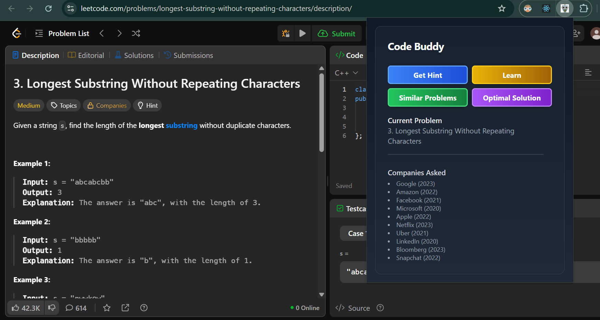
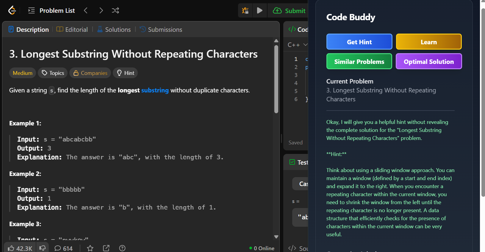
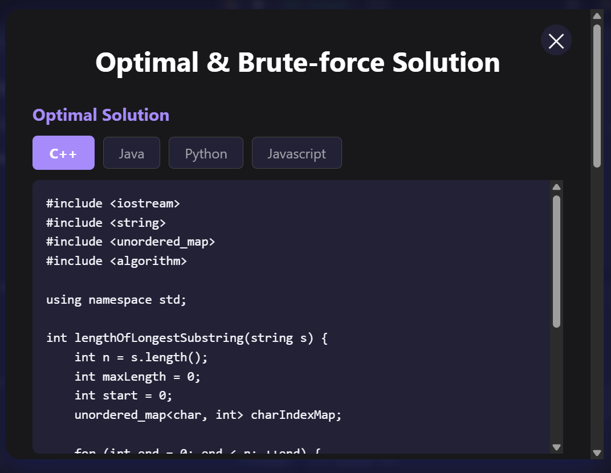
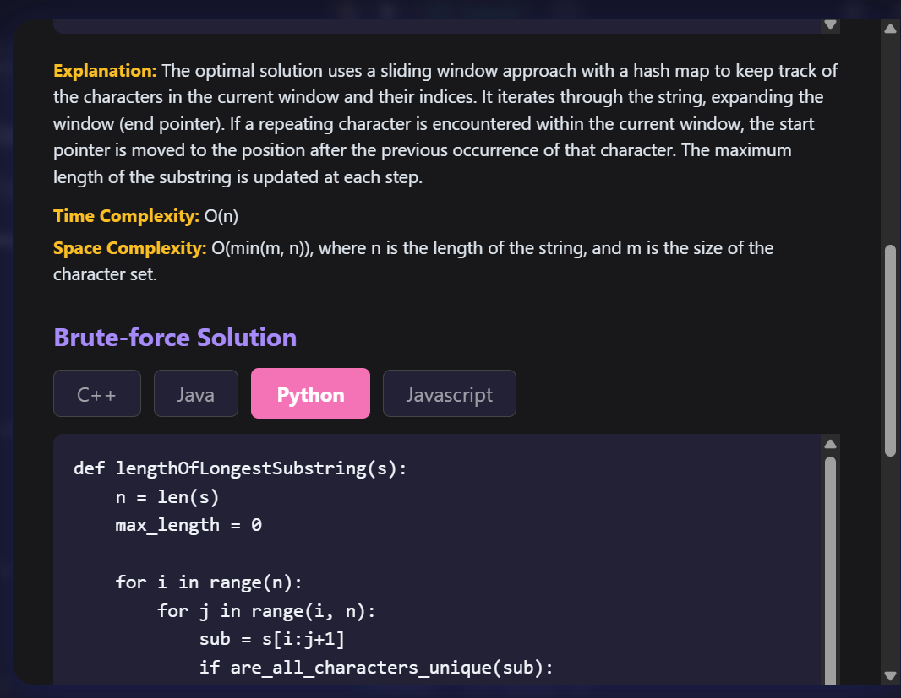
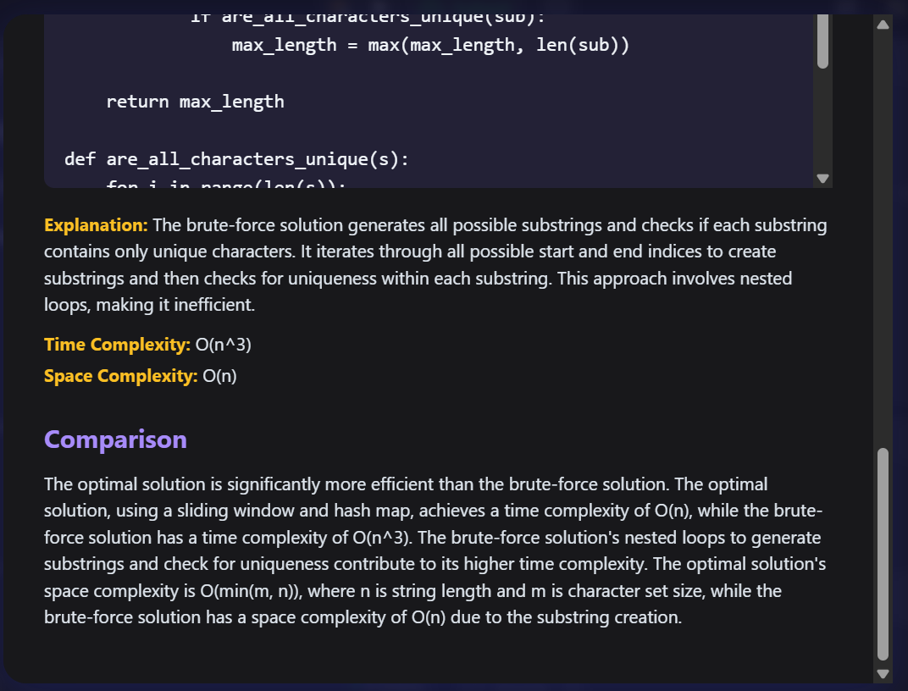
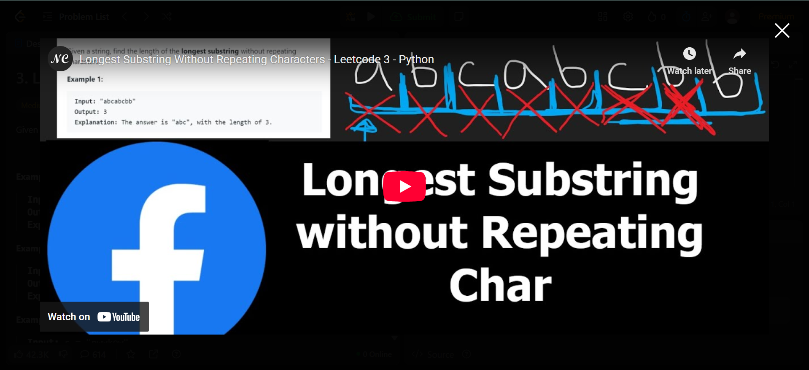
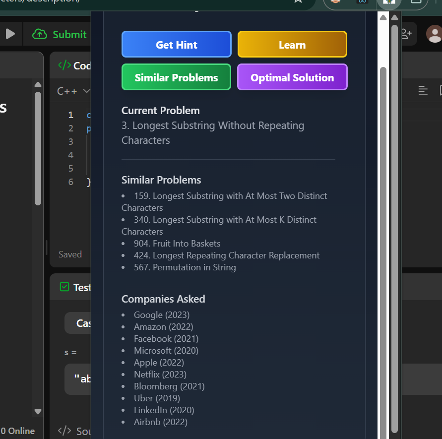

# 🤖 Code Buddy – Your AI Coding Assistant for LeetCode

Code Buddy is an AI-powered Chrome Extension built to assist **LeetCode users** at every stage of solving coding problems.

Whether you're just starting a problem, stuck with an error, or looking to optimize your solution — Code Buddy gives you hints, explanations, optimal code in **multiple languages**, and even learning resources to master the concepts.

---

## 🚀 Features

### 🧠 Get Hint (Before You Code)
- AI-generated **beginner-friendly hints** to help you approach the problem.
- Understand key insights or patterns (e.g., Sliding Window, Binary Search).
- Avoid getting stuck without spoiling the entire solution.

### 🏷️ Company Tags
- Shows **company-wise tagging** of the problem (e.g., asked in Amazon, Google).
- Prioritize problems for your targeted placements or interviews.

### ✅ Optimal Solution Generator
- Once you solve (or give up), get the **optimal solution** in:
  - **C++**
  - **Python**
  - **Java**
  - **JavaScript**
- Includes:
  - **Brute-force version** in all 4 languages
  - **Optimized version** in all 4 languages
  - Clear **step-by-step explanation**
  - **Time and space complexity analysis**
  - Side-by-side **comparison of approaches**

### 🔁 Similar Questions
- Click a button to find **LeetCode question numbers** that are similar by concept.
- Helps you practice variations of the same pattern.

### 📚 Learn Concept (Video-Based)
- Not sure what the concept means?
- Click **Learn** to open a recommended **YouTube video** or course snippet.
- Learn it → apply it → master it.

---

## 🖼️ Screenshots 

### Question and Company Tag



### 🧠 Get Hint Feature


### ✅ Optimal Solution in All Languages




### 📚 Learn Concept Video


### Similar Questions 



---

## 🔧 Installation

 **Clone or Download** this repo:
   ```bash
   git clone https://github.com/your-username/code-buddy.git
   cd code-buddy/extension
